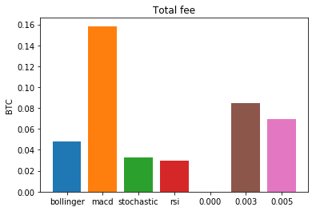
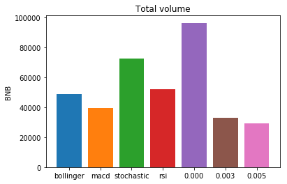
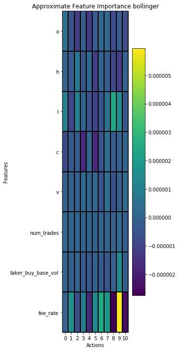

  

  

# Binanace_trading_simulation
This project is to about finding the optimal __Fee__ mechanism in the Exchange. RL agents acts as people under certain Fee policies. We observe how RL agents's behavior changes with Fee mechanism changes. Fee mechanism would change total trade volume and total fee. This project is maintained as Binance Fellowship.

The project overview video : https://youtu.be/kBjv4KmkEHU

Our project environment is based on https://github.com/Yvictor/TradingGym/

# Structure
1. [agent](https://github.com/deconlabs/Binanace_trading_simulation/tree/master/agent)
    Stores trading agents and specify how to train the agents and how to use them. 
2. [data](https://github.com/deconlabs/Binanace_trading_simulation/tree/master/data)
    Stores the historical data to train the agents
3. [env](https://github.com/deconlabs/Binanace_trading_simulation/tree/master/env)
    Stores the environment where fee different fee mechanisms applied

# Simulation Method
 1. **Train RL agents** using [trading gym](https://github.com/Yvictor/TradingGym/). 

 2. **Transfer agents** to different environments where different fee mechanism is applied. 
 Agents will trained again for 500 episodes more to adapt to each environment. Also, differentiate agents by varying risk_aversion ratio so that some agents prefer risk while others not.

 3. **Observe** how agents behave in each environment. Especially watch the total_volume and total_fee from each environment. Derive insights from the observation what characteristics of fee mechanism makes the difference.


# Future Plan
Provide environment where Limit order available -> lagged matching available to reflect more realistic trading environment

# Adopted Fee mechanisms (Could be added more)
1. No fee
2. fee = 0.003 (0.3%)
3. fee = 0.005 (0.5%)
4. Bollinger band bound Environment
5. RSI bound Environment
6. MACD bound Environment
7. Stochastic slow bound Environment


# Used Algorithms for trading agents
## PPO
https://arxiv.org/abs/1707.06347
## Rainbow
https://arxiv.org/abs/1710.02298
## Attention
http://nlp.seas.harvard.edu/2018/04/03/attention.html

# Performance at trading gym


# Usages
```shell
pip install -r requirements.txt
```
1. Train original agent
```python3
cd agent/PPO
python ppo_start.py
```
```python3
cd agent/Attention
python attention_start.py
```
```python3
cd agent/DQN
python dqn_start.py
```
if you want to train multiple agents,
```shell
cd agent/DQN
bash run.sh
```
2. Transfer Learning
```python3
cd agent/DQN
python transfer_learning.py --environment=[environment]
```
if you want to transfer learn multiple agents,
```shell
cd agent/DQN
bash transfer.sh
```
3. Observation
```shell
cd agent/DQN
```
Open Observation notebook and run all cell

## total fee and total volume under different fee rate



## How Data feature affects TradingAgent's Decision
Using [integrated_gradient](https://medium.com/@kartikeyabhardwaj98/integrated-gradients-for-deep-neural-networks-c114e3968eae), we can interpret how agents observe the data.
X axis represents actions and Y axis represents the feature of data. The graph shows how the feature of data affects the action decision of trading agent. You can see that the weight distribution of feature is different depending on the training algorithms.

RAINBOW
